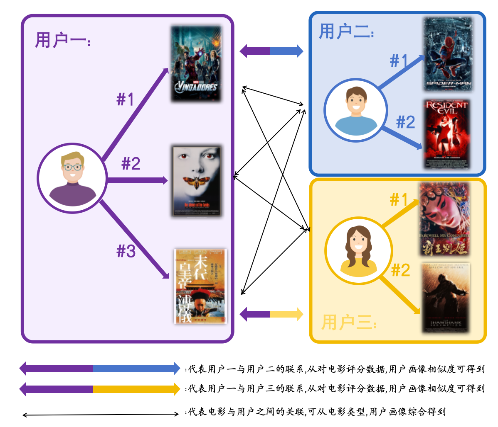
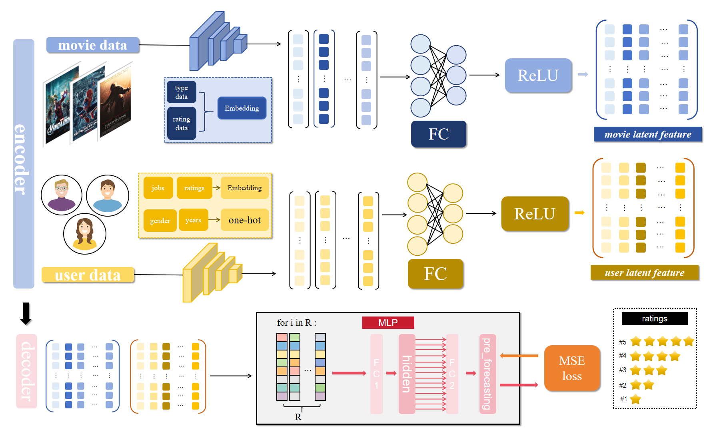
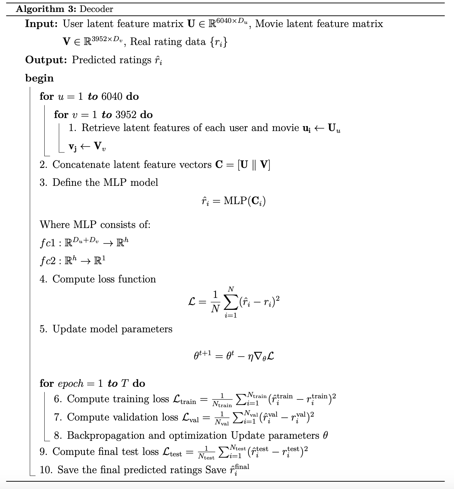
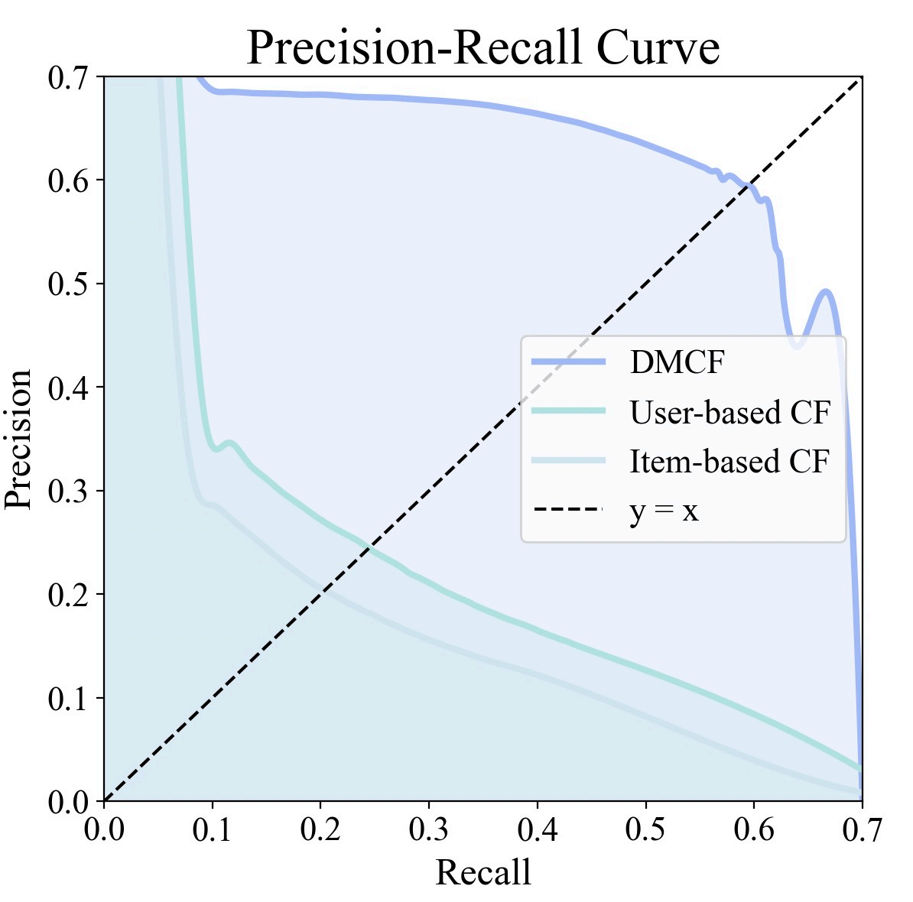

# DMCF-recsys
## 📌 模型简介：DMCF - 深度 MLP 协同过滤推荐系统

这是一个结合深度学习与协同过滤的推荐系统模型——**DMCF（Deep MLP Collaborative Filtering）**。模型融合了传统协同过滤的推荐逻辑与多层感知机（MLP）强大的非线性建模能力，专注于从用户和物品中提取深层隐特征，实现个性化推荐。

这里具体我用了两层MLP，维度均为64*64。而所谓的“深层隐特征”idea，我认为是解码后量化了user和items之间的交互性，例如：对于一个25岁从事计算机行业的Bob而言，最喜欢的电影有《无间道》，《警察故事》等动作悬疑片，这意味着动作悬疑这一题材可能比较受码农人群欢迎，从而将狭义的个人推荐转移至群体画像。

因此对于在推荐系统领域的超级痛点———冷启动问题中，items的详细信息往往已经蕴含，则对于一个新用户，则仅需了解少量的背景，对比老用户信息及其喜好即可。而这个过程显然是可学习的，简单起见，这里用了两层MLP。

然而，以上考虑仅仅user - item间一对一的关系，且归根结底是单向的。并且并没有充分利用我们的评分数据。能不能有一个多对多且多向的推荐呢？当然是有的。🤓

前提是我们需要评分数据，因为评分建立了不同用户和电影之间的桥梁。比方说，loyiv为《末代皇帝》打了高分，在众多tag中，《末代皇帝》与《霸王别姬》重叠度极高，这意味着我可以将《霸王别姬》推荐给loyiv，再结合之前的理论，倘若loyiv也从事计算机行业，《末代皇帝》与《霸王别姬》便可能合Bob的胃口。


当然，这些事很多公司机构早就在干了，逻辑画一个user - item图结构即可。但随着用户量的增多，邻接矩阵会大的离谱，计算开销难以承受。而这个过程同样是可学习的，当我们training完model之后，对于一位用户（已得知基本信息），我们便能得到相应的用户群体以及电影推荐，同样的，对于一个电影，只需要得知基本的类型，便可推算出适合哪类电影。

接下来，便是模型的基本结构介绍：


### 模型结构

- **用户编码器（User Encoder）**：通过 one-hot 编码与 embedding 将用户性别、年龄、职业以及历史偏好电影类型编码为特征向量，提取用户隐特征。
- **电影编码器（Movie Encoder）**：对电影的类型与关联职业信息进行 embedding 处理，并加权聚合，生成电影隐特征。
- **评分解码器（MLP Decoder）**：将用户与电影隐特征拼接后输入至两层 MLP，通过非线性变换预测评分，使用 MSE 损失与 L2 正则化优化训练过程。

### 实验效果

在 MovieLens 数据集上，相较于传统的基于用户/物品的协同过滤，DMCF 在以下指标上取得显著提升：


# 项目环境与依赖说明

基于以下开发环境与依赖库构建：

## ✅ 系统环境

- 操作系统：Ubuntu 22.04
- Python 版本：3.12
- CUDA 版本：12.4
- PyTorch 版本：2.5.1（支持 CUDA 12.4）

## 📦 所需 Python 库

请使用以下命令安装项目所需依赖：

```bash
pip install pandas numpy matplotlib scikit-learn
pip install torch==2.5.1+cu124 -f https://download.pytorch.org/whl/torch_stable.html


